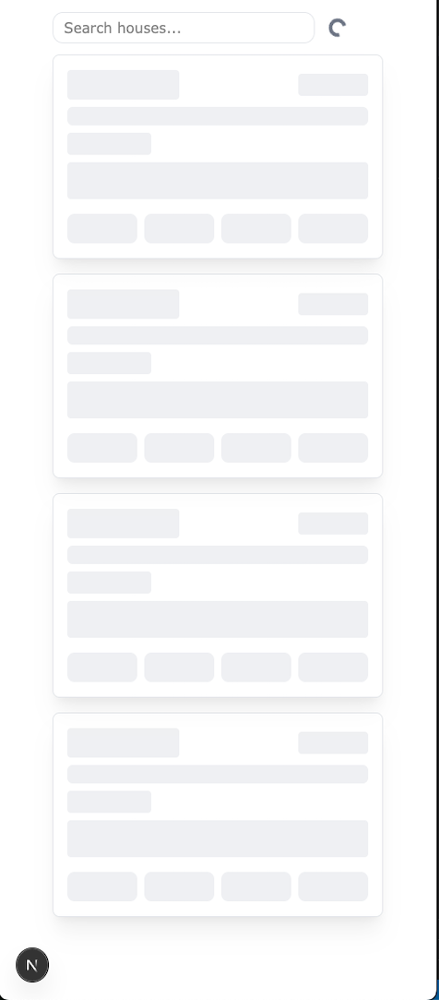
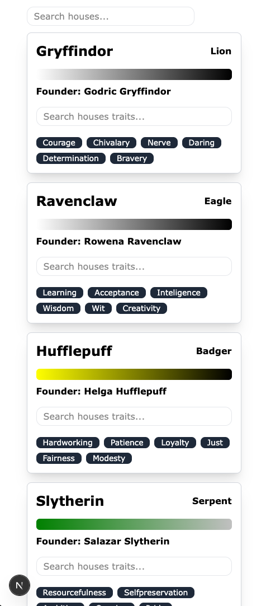
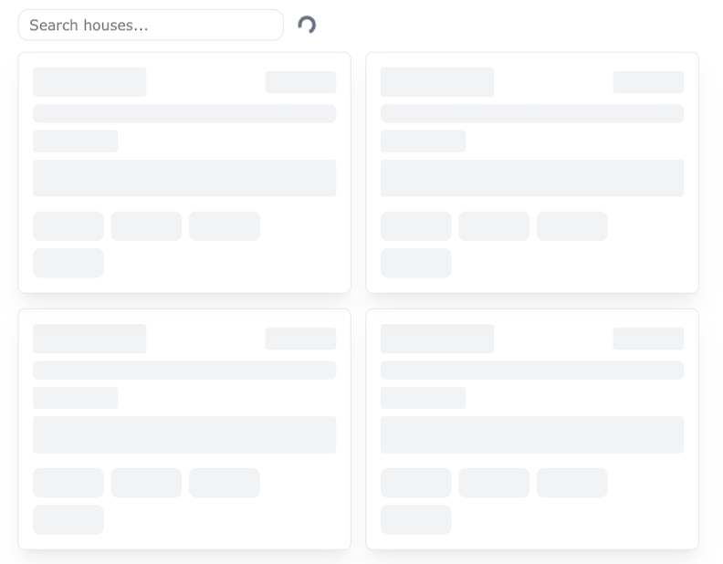
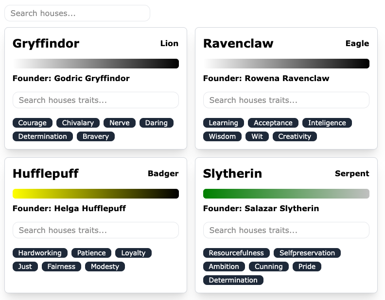

# HarryPotterPort

The Next.js app has been deployed via [Vercel](https://harry-potter-port.vercel.app/).

The Node.js server has been deployed via [Render](https://harrypotterport.onrender.com/) (remember that houses are served under `/houses`).

## Description

This is a *mobile-first* app that serves a simple houses list from the Harry potter Universe:
 - view the extended list of the houses and their properties.
 - search the list using a simple search input field that sends the search query to the backend. The backend responds with a filtered, shorter list of results that match the search criteria.
 - search among the traits of each house.
 
 Built with Next.js/TailwindCSS on the frontend and Node.js/Express on the backend.

1. On _load_ we peek at the related search URL parameter `search=` and submit a request to our server based on that. The user is presented with the list of houses the server responds with:
   - All houses if there is no param
   - The request result if the search param ends up serving a subset of houses 
   - A message `No results found, please try again.` if no results come back.

The user is presented with a search input:
   - A debouncer (300ms) on the input will make sure the data we server to the user are not stale data, anytime within that period (300ms) the user types a request is cancelled, and a new one is being sent, leading the view always represesting the correct state (either `loading` or w/ the correct set of data).
2. When a query has been sent and while the data are being fetched:
   - Aa spinner next to the input field indicates the waiting time.
   - Additionally, a skeleton page of cards in a grid is being shown for better UX.
3. When a request arrives on the server side, we are filtering the cached list for specific substrings inside the name of the houses and, based on the matched ones, we determine the list as a response.
4. The response arrives in the Next.js app and at that point an updated list of houses is being stored using zustand and displayed to the user.
5. Each house card has an inner input filed, which is used to filter the list of traits for each house.

Notes: 
- We have Zustand store, the responses are stored in the zustand store in `useHouseStore` and the set of data fed to `HouseList` are coming from that store. Although this is a simple app, i wanted to use a lightweight store library to demonstrate that data can be stored in a specific place, and then served to multiple places. We could have `Houselist` read off of the store, but that might turn the component not re-useable, hence we pulling the data at `index.tsx` and feeding them to the related component. 
- To mock a CMS behavior, `useContent` has been added, `Optimizations` section holds more information around that.
- a fake delay has been added in the node.js app (server-side), when processing the server-response, to give the user the belief that we are actually acting on the related information, also a small debounce hook has been used to limit the input field changes.

### Screenshots

#### Mobile View
<div style="display: flex;gap: 16px">
    
    
</div>


#### Desktop View
<div style="display: flex; gap:16px">
    
    
</div>


## How to run

1. **Install all dependencies:**

- Node.js v22.16.0 or higher suggested (was developed using that version)

  ```bash
  npm run install:all
  ```

2. **Set up environment variables (in reality this is optional, there are default fallbacks):**

   ```bash
   # In the backend directory
   cp .env.example .env
   ```

   ```bash
   # In the frontend directory
   cp .env.example .env
   ```

   Note: This will create the `.env` files with the necessary environment variables. Make sure to update any values if needed. Both `.env.example` files include the actual values, but this should never happen in the real world, this is a test exercise and values have been committed for your convenience.

3. **Start both frontend and backend servers:**
   ```bash
   npm run start
   ```

The application will be available at:

- Frontend: [http://localhost:4200](http://localhost:3000)
- Backend: [http://localhost:3002](http://localhost:3002)

### Additional Commands

- **Test:**
  ```bash
  npm run test:all
  ```
  This will run the related `test` commands for both backend & frontend folders.

- **Clean up all node_modules:**
  ```bash
  npm run cleanup
  ```
  This will remove all `node_modules` directories from the root, backend, and frontend folders. Useful for doing a clean reinstall of dependencies.

## How to test


Tests are written using `jest`.

  ```bash
  npm run test:all
  ```
  This will run the related `test` commands for both backend & frontend folders.

### Frontend

To run frontend tests:

```bash
cd front_end && npm run test
```

### Backend

Tests are written using `jest`.

To run backend tests:

```bash
cd back_end && npm run test
```

Tests cover:

- Prompt validation
- Response matching
- Front end filtering

### File structure (simplified)

```
├─ README.md
├─ package-lock.json
├─ package.json
├─ back_end
│  ├─ package-lock.json
│  ├─ package.json
│  ├─ server.js
│  ├─ jest.config.js
│  └─ src
│     ├─ app.js
│     ├─ cahce
|     │  └─ house.cache.js
│     ├─ controllers
│     │  ├─ house.controller.test.js
│     │  └─ house.controller.js
│     └─ routes
│        └─ housesRoutes.js
└─ front_end
   ├─ README.md
   ├─ eslint.config.mjs
   ├─ jest.config.js
   ├─ jest.setup.js
   ├─ next-env.d.ts
   ├─ next.config.ts
   ├─ package-lock.json
   ├─ package.json
   ├─ postcss.config.mjs
   ├─ tailwind.config.js
   ├─ tsconfig.json
   └─ src
      ├─ components
      │  ├─ houseCard.tsx
      │  ├─ houseCard.test.tsx
      │  ├─ houseCardSkeleton.tsx
      │  ├─ houseCardSkeletonGrid.tsx      
      │  ├─ houseList.tsx
      │  ├─ searchInput.tsx
      │  ├─ spinnerComponent.tsx
      |  └─ snapshots
      |     └─ houseCard.test.tsx.snap
      ├─ content
      |  ├─ houses.content.ts
      |  └─ index.ts
      ├─ hooks
      │  ├─ useDebounce.ts
      │  ├─ useContent.ts
      │  └─ useHouses.ts
      ├─ models
      │  ├─ head.interface.ts
      │  ├─ content.interface.ts
      │  ├─ house.interface.ts
      │  └─ trait.interface.ts
      ├─ store
      |  └─ house.store.ts
      └─ pages
         ├─ _app.tsx
         ├─ globals.css
         └─ index.tsx

```

### Tech stack

- Next.JS v15
- Node.JS
- Express.JS
- Tailwind
- Jest
- Zustand

### Environmental Variables

Frontend:

| Name                  | Description      |
| --------------------- | ---------------- |
| `NEXT_PUBLIC_API_URL` | local server uri |

Backend:

| Name                  | Description       |
| --------------------- | ----------------- |
| `PORT`                | local server port |
| `CACHE_URL`           | data server api   |

## Optimization

### UX
- Skeleton grid along with spinner component for better UX.
- Used AbortController to cancel the request, if the search input changes withing specific time.
- To enure the URL is in parity with the state of the screen,`router.push` was used to to update the URL without full page reload on search input change.
- Used URLSearchParams and next/navigation to keep search input in sync with query string and to update searchValue from URL on load/navigation

### Architecture
- Jest test were introduced to evaluate the back end and the front end after significant changes. 
- Used Zustand to store data that multiple components can access without passing props but with a simple hook, so there is no need to thread data through components.
- Updating the content (e.g. labels, strings) should not require a new app deployment. To mock this `useContent` was introduced, that based on a pageId would pull the related data from a proper CMS (e.g. Contenstack). For demo purposes, it pulls from `content/` but hopefully my point here managed to get across.
- Refactored backend to separate routing (`house.routes.js`) from business logic (`house.controller.js`)
- Used a clean module-based architecture for search functionality.
- Used tailwind to customized all of the components and make it responsible to different resolutions.

## Future Work
- There should be a database to query the data from, right now we pull the data from `https://wizard-world-api.herokuapp.com/houses` and hold them in an in-memory array - and we do that on every Node.js startup, but in reality we should have a seed action to pull data from a source (e.g. `https://wizard-world-api.herokuapp.com/houses`) and store them in our Database (e.g. a MongoDB), so that we don't have to pull data from `https://wizard-world-api.herokuapp.com/houses` on every startup.
- Dockerize both frontend & backend, to ensure that we can deploy to different setups without affecting the final result.
- Error dictionary on the server-side, where based on the where the errors come up in the flow, a parameterized message is being fed to the frontend, and served to the user. A dictionary would help turning this mechanism maintainable.
- In case this app expands, we could have a folder `/houses` that serves what we have now in `index`.
- Based on the point above, clicking on a card could direct us to the `houses/id` route - which would be served from the `houses/[id]` folder, where more data could be displayed per house.
- Since we are now an app that serves much more data, so not only focused on module `house`, for reach module we would need the related APIs in Node.js & the related folder structure in Next.js